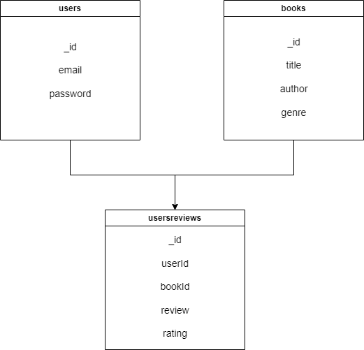

## PROJECT SETUP

1. Clone the repository
2. Install all the node-modules using the command `npm i`
3. All the secrets are kept in .env file (For the sake of assignment commiting the .env file)

> **Note:** MongoDB must be installed locally **with replica set configuration enabled** to support sessions (including **multi-document transactions**).  
> Alternatively, you can use **MongoDB Atlas** or any cloud-hosted MongoDB instance by providing the appropriate connection URI.

## POST COLLECTION LINK
[Link Text](https://www.postman.com/supply-architect-93224319/workspace/public-collection-bandasyam/collection/37333128-de6dfcb0-a688-4fbd-8f10-f0872c199000?action=share&creator=37333128
)

## 📘 MONGODB SCHEMAS

### 🧑‍💻 Users Collection

| Field      | Type     | Description       |
| ---------- | -------- | ----------------- |
| `_id`      | ObjectId | Unique identifier |
| `email`    | String   | User email        |
| `password` | String   | User password     |

---

### 📚 Books Collection

| Field    | Type            | Description            |
| -------- | --------------- | ---------------------- |
| `_id`    | ObjectId        | Unique identifier      |
| `title`  | String          | Book title             |
| `author` | String          | Author name            |
| `genre`  | Array of String | Genres of the book     |
| `count`  | Integer         | Total count of reviews |
| `rating` | Integer         | Average rating         |

---

### 📝 UsersReviews Collection

| Field    | Type     | Description                    |
| -------- | -------- | ------------------------------ |
| `_id`    | ObjectId | Unique identifier              |
| `userId` | ObjectId | Reference to the user          |
| `bookId` | ObjectId | Reference to the reviewed book |
| `rating` | Integer  | Rating given by the user       |
| `review` | String   | Review content                 |

## ER DIAGRAM

